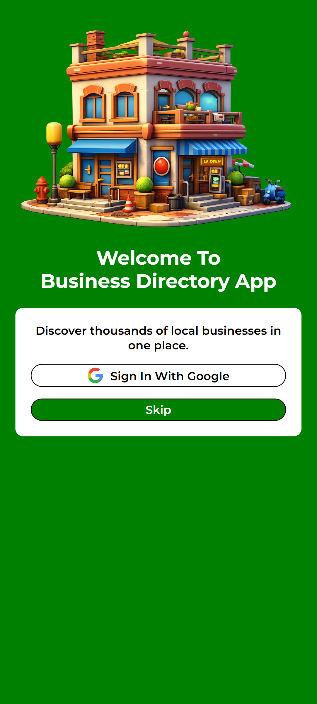
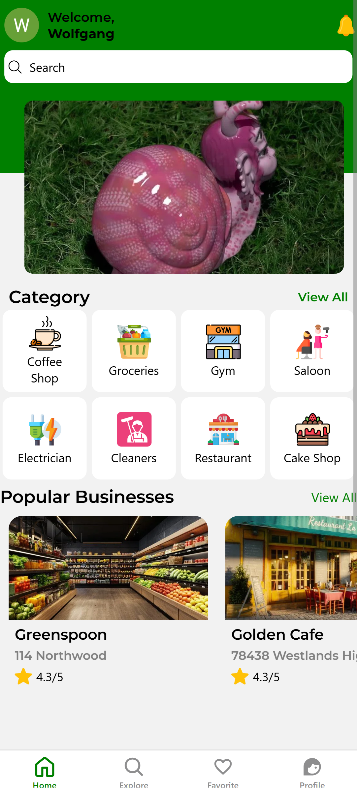
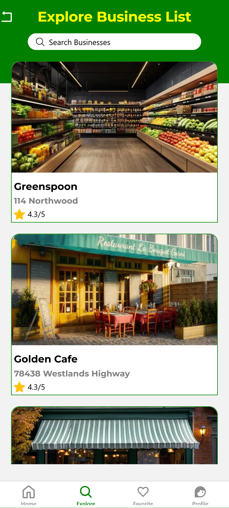
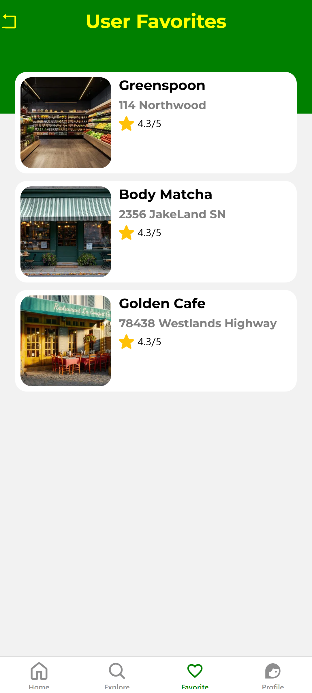
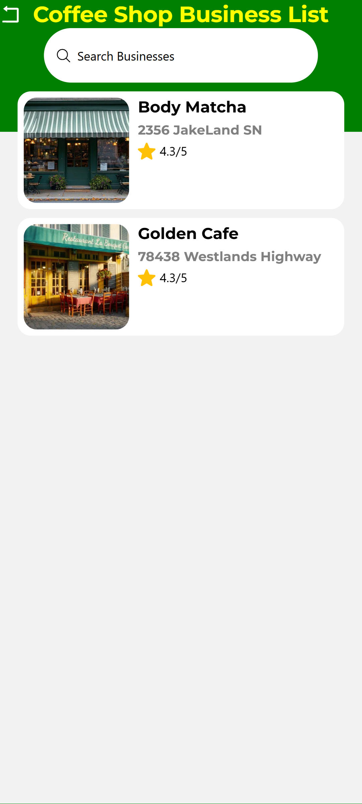
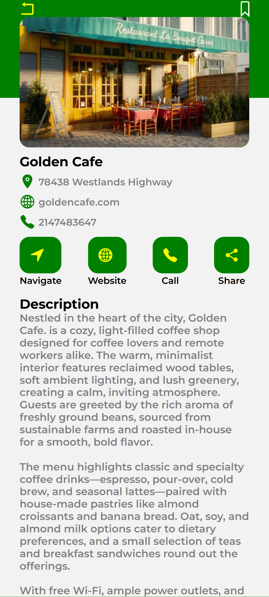
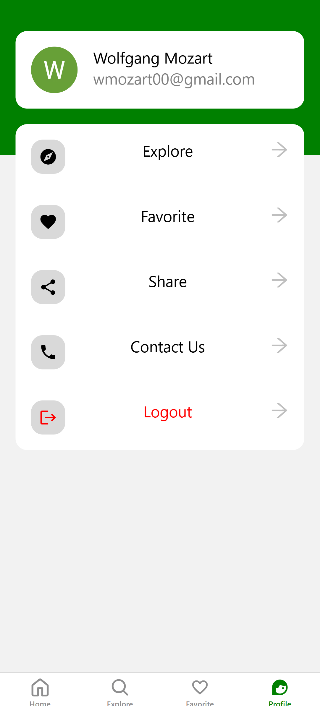

<h2>📱 Business Directory Mobile App</h2>

<strong>Mobile Business Discovery Platform with Clerk-Driven Data & Identity Management</strong>

<strong>🔎 Overview</strong>

A cross-platform mobile application designed to help users discover and explore local businesses across categories such as restaurants, cafés, gyms, and retail stores.
Unlike a traditional setup, this project leverages <strong>Clerk not only for authentication</strong>, but also as a <strong>core data and identity layer</strong> for managing user profiles, business entities, and category relationships.

<strong>💻 Tech Stack</strong>

<ul>
  <li>📱 Frontend: React Native (Expo)</li>
<li>  Backend (Headless CMS):  Strapi – Managed users, businesses, categories, favorites, and custom lists via auto-generated REST APIs</li>
<li>🗄️ API Layer: Strapi RESTful endpoints consumed by the mobile app</li>
<li>🗃️ Database: MySQL (XAMPP – local development)</li>
<li>⚛️ State Management: React Hooks</li>
</ul>

<strong>⚙️ Core Functionalities</strong>

<ul>
  <li>👤 User Profiles via Clerk — Centralized user identity and profile management.</li>
  <li>🏪 Business Components — Businesses are modeled as structured Clerk-managed entities.</li>
  <li>🗂️ Category-Based Discovery — Business categories dynamically drive navigation and filtering.</li>
  <li>🔥 Popular Businesses — Highlighted based on engagement and interaction logic.</li>
  <li>❤️ Favorites System — Users can save and manage preferred businesses.</li>
  <li>🔍 Search & Explore — Discover businesses across categories with real-time filtering.</li>
</ul>

<strong>🖼️ Screenshots</strong>

   
Landing Page 

  
   
Home Page 

  
   
Explore Page

  
   
 Favorite Page 

  
   
Business Category Page

  
   
 Business Detail Page 

  
   
 Profile Page 

  

